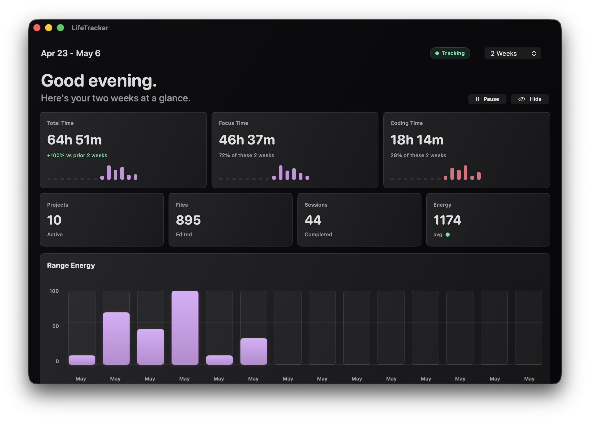
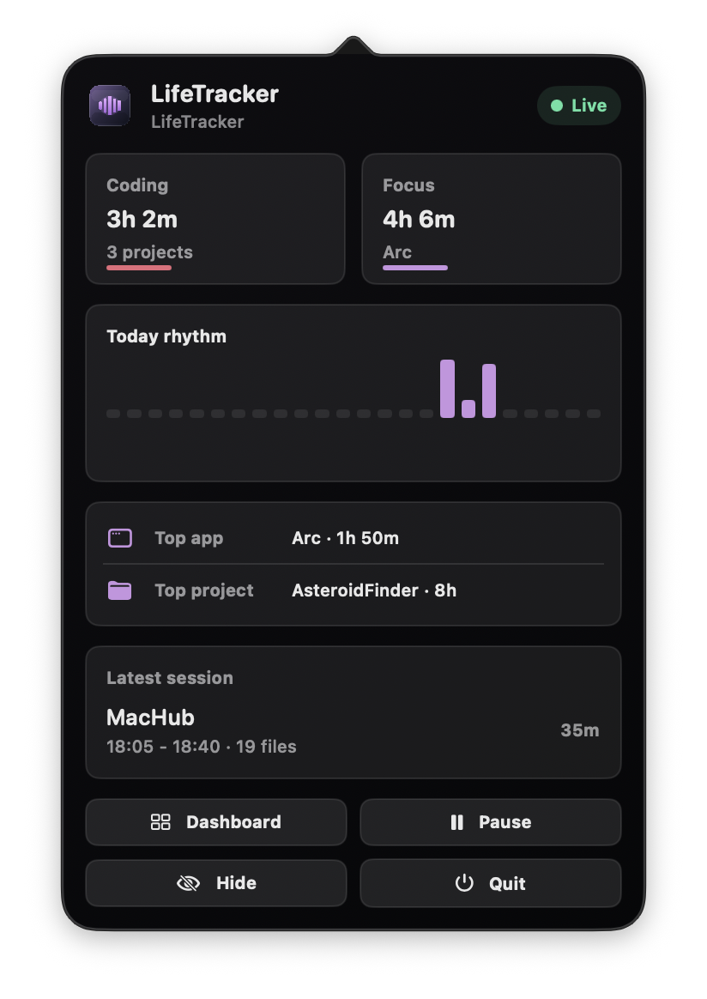

# LifeTrackerMac

LifeTrackerMac is a native SwiftUI macOS menu-bar app for understanding where coding and focus time went. It runs locally, keeps a quiet dashboard, and summarizes activity from app focus and file changes.



## Highlights

- Menu-bar status app with a compact live popover.
- Dashboard for today, week, multi-week, monthly, and longer ranges.
- Coding sessions inferred from file create/modify/delete activity.
- Foreground app focus summaries.
- Project, file, session, timeline, energy, and insight views.
- Local JSON archive with retention trimming.
- No screenshots, keystrokes, file contents, browser URLs, or window titles are recorded.



## Privacy

LifeTrackerMac stores local metadata only:

- foreground app names from `NSWorkspace`
- file create/modify/delete events under selected watch roots
- coding session summaries derived from file activity
- token/symbol summary stats for touched text files, not raw contents
- local JSON persistence in `~/Library/Application Support/LifeTrackerMac/activity.json`

It does not send data to a server.

## Build

```bash
swift build -c release
```

## Run

```bash
swift run -c release LifeTrackerMac
```

## Package App

```bash
./scripts/package_app.sh
```

The packaged app is written to:

```text
dist/LifeTracker.app
```

To install locally:

```bash
rm -rf /Applications/LifeTracker.app
cp -R dist/LifeTracker.app /Applications/LifeTracker.app
open /Applications/LifeTracker.app
```

## Default Watch Root

The app defaults to watching:

```text
~/Desktop/CODING
```

You can adjust watch roots in the app settings.
